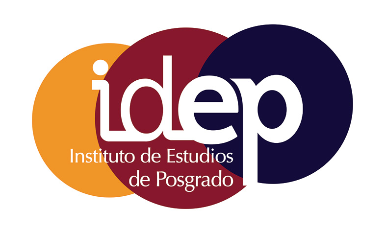

  
{ width=10% } 
{ width=10% } 
{ width=10% } 
{ width=10% }

## Presentación

Todos aquellos que trabajan en **análisis de datos** o **ciencia de datos** habrán observado que los datos se generan de forma continua y a un ritmo cada vez más acelerado. Aunque los analistas suelen estar formados para trabajar con **datos tabulares o estructurados**, principalmente **numéricos**, una gran parte de los datos que proliferan hoy en día son **no estructurados** y centrados en **texto**.

En este curso aprenderás cómo, mediante la aplicación de los principios de **datos limpios y ordenados (_tidy data_)**, es posible **facilitar muchas tareas de minería de texto**, haciéndolas más eficaces y coherentes con las herramientas que ya se usan ampliamente en análisis de datos. Tratar el texto como **marcos de datos compuestos por palabras individuales** permite **manipular, resumir y visualizar** fácilmente las características del lenguaje, e **integrar el procesamiento de lenguaje natural** en flujos de trabajo ya conocidos.

Este curso es una **introducción práctica** a la **minería de texto con el paquete `tidytext`** y otras herramientas tidy en **R**. El enfoque es eminentemente práctico, centrado en ejemplos con software y exploraciones de **datos reales**.

## Información

**Dirección Académica y Profesorado:**  

- [Dr. José V. Die ](mailto:jose.die@uco.es)
  *Dept. de Genética-ETSIAM.* Universidad de Córdoba.  

## Fechas del Curso y Lugar
  
**Lugar:** Aula de Informática, [Facultad de Filosofía y Letras](https://www.uco.es/filosofiayletras/images/documentos/planos-situacion.pdf). Plaza del Cardenal Salazar 3, Córdoba.

* El curso se ha organizado en los siguientes días y horas: 

| **Semana 1**   | **Día** | **Hora** |
  |:---------------|:-------|:------|
  | | Lunes, 6 octubre  | 10:00-13:00  |
  | | Martes, 7 octubre  | 09:30-13:30  |
  | | Miércoles, 8 octubre | 09:30-13:30  |
  | | Miércoles, 8 octubre    | 15:00-18:00 |
  | | Jueves, 9 octubre    | 09:30-13:30 |
  
| **Semana 2**   | **Día** | **Hora** |
  |:---------------|:-------|:------|
  | | Martes, 14 octubre  | 10:00-13:00  |
  | | Miércoles, 15 octubre | 10:00-13:00  |
  | | Miércoles, 15 octubre | 15:00-18:00  |
  | | Jueves, 16 octubre    | 10:00-13:00 |
  
  
## Programa del Curso
  
#### Módulo 1: Fundamentos básicos de `R`.
  - Instalación de `R` y `RStudio`
- Entorno de trabajo
- Definiendo vectores
- Manipulando vectores
- Tablas de datos

#### Módulo 2: Texto como dato. 
  - tokenización
  - visualización de palabras
  -   [código](script2.html)

 
    
    
**Cambios de última hora:** Es posible que el esquema y plan del curso visto anteriormente pueda sufrir modificaciones y readaptaciones en función de la disponibilidad del aula de impartición y/o el grado de avance de la materia.   

## Archivos de interés

- Guía de estilo (por [Hadley Wickham](http://adv-r.had.co.nz/Style.html))
- Code to Joy (The Economist, por [Andrew Smith](https://www.economist.com/1843/2018/05/29/code-to-joy))

---
  
  Organiza :
  
  { width=15% } { width=15% }
